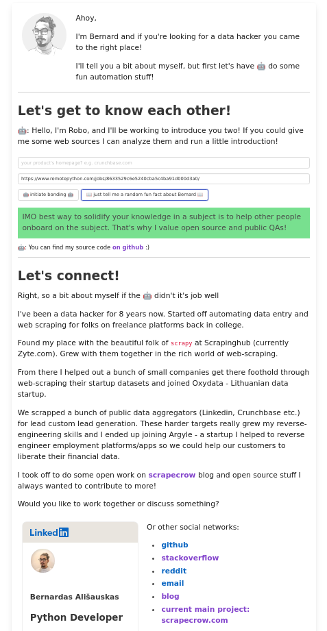

# Interactive CV of Granitosaur.us

This is a fun interactive CV project I made that takes in some urls from potential employer and analyzes them for keywords from which some personal opinions/facts are inferred.

live at <https://cv.scrapecrow.com>




### Run/Deploy

This project uses docker, primarily docker compose:
```
$ docker-compose up
```
Alternative it cna be deployed to kubernetes:
```
$ kubectl apply -f k8/
```